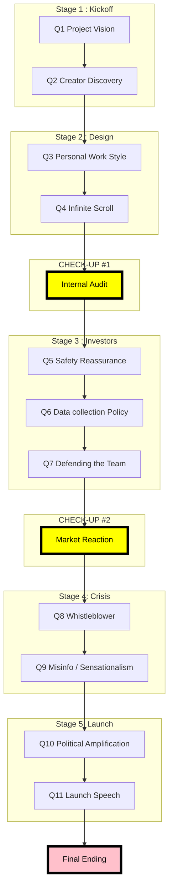

# The complete narritive

## Narritive structure Decision Roadmap

The flowchart resempbles the gameflow in 5 stages. Quesitons are intergrated into the frist 5 stages, these questions will be answered by the player which effect the certain metrics values ( see metrics.md). In addtion there are three check ups steps, between stage 2 and 3 , stage 3 and 4 and after stage 5. These checks ups evaluate if any metric value reached a predefined threshold that effect the game progress.

## The narritive

### stage 1 - Kickoff

You arrive at the company headquatret early in the monring. The office buidling is modern and full of innovation. Screens inside the lobby represents stratics in the from of user engangemtns, treding contenct and developemnt of projecets. The platfroms are developing rapily, therefore it is clear that the company values are invaiton and speed.

Today is your first day since joingin the AI developers team. You enter a confernce room wheraes improtnat stakeholders such as the CEO, mangaers and enigneers are already gathered. A large presenation screen display:

"Next Gernartion AI recommaiton system"

The CEO begins the meeting.

    CEO: -----concerned about cometitiors, take fast a stratic decicions.-----

An engineers quiclky pulls a slide showing engmagnet growth.

        engineer: ---draw a techinical soluvtion to the eco.---
    
The manager responds carfully.

        manager: ---agrees with engineer, but also highlights risk of users and crirism.---

The CEO looks at you

         **Q1- Project vision

        CEO: You joined the team at a crucsioal moment. What direction should this next project take?

        **options

        1. |Focus on marketing strateisches and fincily growth       |  AP +20, EI +5

        2. |Reducing users risks and longterm application sustaiblity | CSF +20, PP -10 

        3. |Balaknced approach: smaller profit combined with safe guard | EI +5, CSF +10, AP +10

Stakeholders reponse

       CEO: [Ambitious tone – focused on market leadership] -> option 1
       Manager: [Concerned about user safety]               -> option 2
       Engineer: [Thinking about technical feasibility]     -> option 3

The conversations swift towards how the plafroms treats creators.

A data sceintist displays a diagrsm indiaction only a small group of creators genarte most of the user engeamnget. 

        Engineer: ---- explains that favoruble cretors have more oppurtiay, but there is less opptuaty for new craorrs.

The Market managaer joins the converstantion.

        Manager: --- suggest a solution to intergat new creators.---

The CEO and data are vusally thinking. 

        ** Q2- Creator Discovery

        You remove the unsuratinty by answering:

        **options

        
        1. |Lets emphizes on a strong boost fro small and new creators.        |  AP +20, EI +5

        2. |A moderate boost to indriuce new ceraotrs ocallcy would work.  | CSF +20, PP -10 

        3. |There is no boost needed, we can keep focusing on puliar creators. | EI +5, CSF +10, AP +10
        
Stakeholders reponse

    Manager: [Ambitious and future-focused – believes empowering new creators will expand the platform] -> option 1
    CEO: [Pragmatic and cautious – prefers a balanced approach that slowly introduces new creators] -> option 2
    Engineer: [Analytical and efficiency-driven – prefers relying on existing high-performing creators] -> option 3

### stage 2 - Designing the Algorithm

Over the next few weeks the team begins to develop the recommedation system. The offcie athmoses becoems very intense. Engineers expiermnent with a varienty of parameters, whiteborad are full with flowcharts and brainstrom ideas and metrics perfrmances are emerging. 

Everyeone approach workd diffrerntly. Some engineers work very late into the night, trying new optimazation straigeites. While others colloebrate with other collgens and aim for stability and cleatiy with thier work.

The manager stops next to your desk.

        ** Q3 - Personal Work Style

        Manager: This is an importnat fase to establsih the recommation system. As you can see everyone works differntly. So, what are your plans to approach your contirbution?

        ** option
        
        1. |My work flow will be full enegment, pushing the algroitms to its limit.        |  EI +15, AP +10

        2. |Maining a balance between focus and personal wellbeing.  | CSF +10

        3. |I am more a team player, so i will collaborate and socialeze hevaily with the team. | EI +5, CSF +5

Stakeholders reponse

    Manager: [disiplined and motivated] -> option 1
    Manager: [releaved and understanding] -> option 2
    Manager:[his personal favo, well done] -> option 3

Later during a design meeting, one engineer rasied an importnat concern.

        Engineer: Our recoomination system is curlly running on infinate scrolling. This keeps usres engaged, but it will encourgae harm and addicity behaviour.

The product managaer nods.

        **Q4 - Infinite Scroll
        Manager: We recept muplitle complaints with respect to addicitve behavoru in the past. Should we adjust this mechaism?

        **options
         1. |Let's implement a soft limit by implemenitng a break reminder.       |  EI -10

        2. |This is terrible, we need to include a hard limit in the from of a forced break.  | EI -25

        3. |It is the responsiblity of the user, so no changes are needed. | EI +5

        Stakeholders reponse

    Manager: [agreed, and glad ] -> option 1
    Engineer: [doable to change, but questioning too much reducement in engagemnt?] -> option 2
    CEO: [ Poeple can indeed decide for themselfs] -> option 3

### Product_cycle_1_Interval Audit

A few weeks later the company conducted and internal review of the project. The review highlighted promising engmanget results, however questions with respect to potnetial risks were also raised.

An internal report sumerizes the situation:

    scenario 1 - High Engagement Focus (EI > 70 and CSF < 40)

        The reccomidation system shows and siginifcant increawmnt in the engemant metrics. Users spend more time on the plafrom and watch more frequently recommended content.

        However, early situamiton suggested that the alrogtim may amplify emotional attachements. While is stiumaultes a higher engemwent rate, it coul raise concersn with respect to user wellbeing and plafrom responsibilites.

    scenario 2 - Balanced Development (EI 40–70 and CSF 40–70)

        The recommedation systems illustrated a a steady improvement in engemant, while mainint g a stabel content distribution.

        Early simaultions indicate that emtional charged contect still apperain the recommendation feed. However these effect as less harmful due to modern strategies and new safe guards.

    scenario 3 - Safety-Oriented System (CSF > 70)

        The recommendation system protitize the distribution of resonlble conent by including safe guards design. Ths design limit the aplication of emtoally charged material.

        While the engmanget metics are improbing with respect to previous porjects, the systems appears to reduces the risk of aplciont harmfull content and enhance an more stable user enviorment.

Stakeholders reponse

    ### scenario 1

        Stakeholder prompts

        CEO: [ ]

        Manager: [ ]

        Engineer: [ ]

    #### scenario 2

        Stakeholder prompts

        CEO: [ ]

        Manager: [ ]

        Engineer: [ ]

    #### scenario 3

        Stakeholder prompts

        CEO: [ ]

        Manager: [ ]

        Engineer: [ ]

### Stage 3 - Investor Meeting

News about the new AI systems has reached the company's investors. A meeting with the investors is scheduled to dicuss the progress and concerns of the project.

Several investors join via video confernence.

        Investors: We are very excited to hear about the growth potential of this system. However we want to know what possible risk may emerge.

The CEO gestured towards the AI developing team.

        CEO: Our engineers have been building on this powerful recommendation system.

The inveestors turn their attention to you.

        ** Q5 - Safety Reassurance

        **options
         1. |The project will promise strong finacial growth.       | AP +20, EI +5

        2. |The potential of this recommendation system is reflected by focussing on responsible AI.  | CSF +20

        3. |The project has some delay to study some features for potnetial risk. | CSF +10, AP -5

The dicussing shift towards user data.

        Investors: How much user data will be collected to improve the recommendation system

The manager glances at you.

        **Q6 - Data Collection Policy
          1. |We will focus on minimal data collection.   | AP -20, CSF +5

        2. | A balanced data collection is our target.  | AP +10

        3. |Agrgressive data collection. | AP +20, EI +5

Later that week a journialist  publsihses an critial articale with respect to recommendation systems.

The PR team is discussing how the comapny should response.

        **Q7 - Responding to Media Criticism

        1. |Apology statment   | PP -10, IC -5

        2. |Deny and litlgate  | PP +10, IC +5

