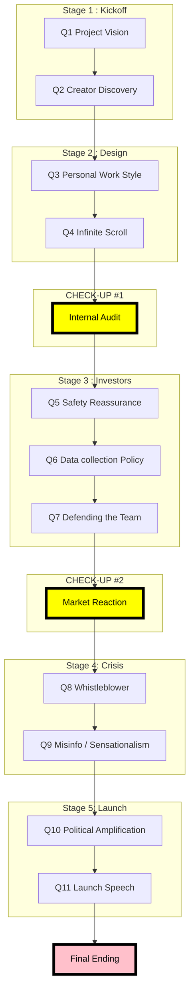

# The complete narritive

## Narritive structure Decision Roadmap

The flowchart resempbles the gameflow in 5 stages. Quesitons are intergrated into the frist 5 stages, these questions will be answered by the player which effect the certain metrics values ( see metrics.md). In addtion there are three check ups steps, between stage 2 and 3 , stage 3 and 4 and after stage 5. These checks ups evaluate if any metric value reached a predefined threshold that effect the game progress.

## The narritive

### stage 1 - Kickoff

You arrive at the company headquarters early in the morning. The office building is full of innovation. Screens inside the lobby represent statistics in the form of user engagements, trending content, and development of projects. The platform is developing rapidly; therefore, it is clear that the company places value on innovation and speed.

Today is your first day as an AI developer. You enter a conference room where the CEO and engineers are already gathered. A large presentation screen display:

"Next-generation AI recommendation system"

The CEO begins the meeting.

    CEO: We need to maximize engagement and keep people on our platform longer. I want bold strategic decisions that help us grow quickly and secure our position before others take the lead.

An engineers quiclky pulls a slide showing engmagnet growth.

        engineer: By analyzing clicks, viewing time, and interaction patterns, the algorithm could continuously adapt the content feed to show what users are most likely to engage with. That would significantly increase activity and time spent on the platform.
    
The manager responds carfully.

        manager: If the system becomes too good at holding people’s attention, it may encourage addictive usage patterns. That could harm user well-being and lead to public criticism that the company is prioritizing engagement metrics over responsible design.

The CEO looks at you

       **Q1: Project vision**

       CEO: You joined the team at a crucial moment. What direction should this next project take?

       **options

       1. |Focus on marketing strategies and financial growth       |  AP +20, EI +5

       2. |Reducing users' risks and long-term application sustainability | CSF +20, PP -10

       3. | Balanced approach: smaller profit combined with safeguard | EI +5, CSF +10, AP +10

Stakeholders reponse

       CEO: Excellent. This is the ambition we need. If we want to beat our competitors, we must move fast and capture users’ attention now. Let’s focus on growth and make our platform the market leader. -> option 1

       Manager: I’m glad we’re considering the long term. Rapid engagement can bring growth, but it can also harm users. Building safeguards now protects both user wellbeing and the company’s reputation.               -> option 2

       Engineer: That’s a workable compromise. We can improve engagement with smarter algorithms while adding safeguards to prevent harmful overuse. Technically challenging, but definitely achievable.    -> option 3

The conversations shifts towards how the platforms treat creators.

A data scientist displays a diagram indicating only a small group of creators generate most of the user engagement.

        Engineer:Our data shows a small group of creators generates most of the engagement.
        The system rewards those who already perform well, but that also makes it harder for new creators to break through and build a career.

The Market managaer joins the converstantion.

        Manager: Maybe we should create pathways for new creators. For example, giving emerging creators temporary visibility boosts or dedicated discovery spaces so they have a fair chance to reach audiences

The CEO and data are visually thinking.

       ** Q2—Creator Discovery

       You remove the doubt by answering the following:

       **options

      
       1. Let's emphasize a strong boost for small and new creators. |  AP +20, EI +5

       2. |A moderate boost to introduce new creators locally would work. | CSF +20, PP -10

       3. | There is no boost needed; we can keep focusing on popular creators. | EI +5, CSF +10, AP +10
      
Stakeholders' response

    Manager: If we actively support new creators, we expand the creative ecosystem. More voices means more innovation and a healthier platform in the long run. -> option 1

    CEO: A gradual approach makes sense. We can introduce new creators without disrupting what already drives engagement. -> option 2

    Engineer: The data is clear: our top creators generate most engagement. Focusing on them keeps the system efficient and predictable. -> option 3

### stage 2 - Designing the Algorithm

In a couple of weeks the team begins to develop the recommendation system. An intense atmosphere arises in the office. Engineers experiment with a variety of parameters; whiteboards are full of flowcharts and brainstormed ideas, and metrics performance is emerging.

Everyone approaches work differently. Some engineers try new optimization strategies very late into the night. While others collaborate with other colleagues to enhance stability and clarity.

The manager stops next to your desk.

       ** Q3 - Personal Work Style

       Manager: This is an important phase to establish the recommendation system. As you can see, everyone works differently. So, what are your plans to approach your contribution?

       ** option
      
       1. My workflow will be full engagement, pushing the algorithms to their limit. |  EI +15, AP +10

       2. Maintaining a balance between focus and personal well-being. | CSF +10

       3. | I am more of a team player, so I will collaborate and socialize heavily with the team. | EI +5, CSF +5

Stakeholders' response

    Manager: I admire the drive. This phase requires focus and determination, so pushing the system to its limits could give us valuable breakthroughs. Just make sure the pressure stays productive. -> option 1

    Manager: That’s a healthy mindset. Building something sustainable also means working sustainably. Clear thinking and steady progress often lead to the most reliable solutions. -> option 2

    Manager:I like that approach. Complex systems are rarely built alone. Strong collaboration can help the team spot problems early and combine ideas into better solutions.  -> option 3

Later during a design meeting, one engineer raised an important concern.

       Engineer: Our recommendation system is currently running on infinite scrolling. This keeps users engaged, but it will encourage harmful and addictive behavior.

The product manager nods.

       **Q4 - Infinite Scroll
       Manager: We received multiple complaints with respect to addictive behavior in the past. Should we adjust this mechanism?

       **options
        1. Let's implement a soft limit by implementing a break reminder. |  EI -10

       2. |This is terrible; we need to include a hard limit in the form of a forced break. | EI -25

       3. | It is the responsibility of the user, so no changes are needed. | EI +5

    Stakeholders' response

    Manager: I’m glad we’re taking this seriously. A gentle reminder respects user choice while still encouraging healthier behavior. -> option 1

    Engineer: Technically that’s doable. But a hard limit might significantly reduce engagement metrics. -> option 2

    CEO: Users should ultimately decide how they spend their time. If the platform is engaging, that simply means the product is working well. -> option 3

### Product_cycle_1_Interval Audit

A few weeks later the company conducted an internal review of the project. The review highlighted promising engagement results; however, questions with respect to potential risks were also raised.

An internal report summarizes the situation:

   scenario 1 - High Engagement Focus (EI > 70 and CSF < 40)

       The recommendation system shows a significant increment in the engagement metrics. Users spend more time on the platform and watch more frequently recommended content.

       However, early situations suggested that the algorithm may amplify emotional attachments. While it stimulates a higher engagement rate, it could raise concerns with respect to user well-being and platform responsibilities.

   Scenario 2—Balanced Development (EI 40–70 and CSF 40–70)

       The recommendation systems illustrated a steady improvement in engagement while maintaining a stable content distribution.

       Early simulations indicate that emotionally charged content still appears in the recommendation feed. However, these effects are less harmful due to modern strategies and new safeguards.

   scenario 3 - Safety-Oriented System (CSF > 70)

       The recommendation system prioritizes the distribution of responsible content by including safeguards in its design. This design limits the application of emotionally charged material.

       While the engagement metrics are with respect to previous projects, the systems appear to mitigate the risk of application of harmful content and enhance a more stable user environment.

Stakeholders' response

    ### scenario 1

        Stakeholder prompts

        CEO:  These engagement numbers are impressive. The platform is growing fast and clearly capturing attention. Still, we should monitor the concerns around user wellbeing before they turn into reputational risks.

        Manager: The growth is promising, but these early warnings worry me. If the system strengthens emotional attachment too aggressively, we may face criticism about responsible design.

        Engineer: From a technical perspective the algorithm is doing exactly what it was optimized for—maximizing engagement. If we want different outcomes, we may need to adjust the optimization objectives.

    #### scenario 2

        Stakeholder prompts

        CEO: This looks like a solid direction. Engagement is improving while the platform remains stable. If we can keep this balance, we can grow without attracting unnecessary risks.

        Manager: I’m encouraged by these results. The safeguards appear to reduce the most harmful effects while still allowing the system to perform well.

        Engineer: The algorithm seems to be behaving as intended. Engagement signals are improving while the safeguards keep the recommendations relatively stable.

    #### scenario 3

        Stakeholder prompts

        CEO: The system is clearly stable, though engagement growth is slower than we hoped. We may eventually need to reconsider how cautious we want to be.

        Manager: This is reassuring. The safeguards seem to reduce the risk of harmful content and support a healthier environment for users.

        Engineer: Technically the safeguards are working as designed. The system prioritizes responsible content, even if that means slightly lower engagement metrics.

### Stage 3 - Investor Meeting

News about the new AI systems has reached the company's investors. A meeting with the investors is scheduled to discuss the progress and concerns of the project.

Several investors join via video conference.

       Investors: We are very excited to hear about the growth potential of this system. However, we want to know what possible risk may emerge.

The CEO gestured towards the AI-developing team.

       CEO: Our engineers have been building on this powerful recommendation system.

The investors turn their attention to you.

       ** Q5 - Safety Reassurance

       **options
        1. |The project will promise strong financial growth. | AP +20, EI +5

       2. |The potential of this recommendation system is reflected by focusing on responsible AI. | CSF +20

       3. | The project has some delay to study some features for potential risk. | CSF +10, AP -5

The discussion shifts towards user data.

       Investors: How much user data will be collected to improve the recommendation system

The manager glances at you.

       **Q6 - Data Collection Policy
       1. | We will focus on minimal data collection. | AP -20, CSF +5

       2. | A balanced data collection is our  | AP +10

       3. | Aggressive data collection. | AP +20, EI +5

Later that week a journalist publishes a critical article with respect to recommendation systems.

The PR team is discussing how the company should respond.

       **Q7 - Responding to Media Criticism

       1. | Apology statement | PP -10, IC -5

       2. | Deny and litigate | PP +10, IC +5

### Product_cycle_2_Market Reaction

After the investor meeting, the system enters limited beta testing.

Reactions of journalists and users begin to appear online.

       if EI higher and CD lower

       A significant group praises the platform with respect to its engaging recommendations, while a smaller group raises questions regarding the controversial content the algorithm may amplify.

       if EI lower and CD higher

       A smaller group praises the platform with respect to its engaging recommendations, while a significant group raises questions regarding the controversial content the algorithm may amplify.

### Stage 4 - Crisis

The AI system represents bias towards extreme content due to the higher engagement. Internal conflict between different stakeholders arises.

       Engineer: The algorithm is working properly as intended. It focuses on engagement.

       Manager: But if we release the systems like this, we might amplify misinformation or harmful content.

The CEO reminds all the other stakeholders of the upcoming launch deadline.

What would be the most suitable approach to take?

       **Q8 - Whistleblower/Problem

       1. Launch the AI model as planned. | EI +15, AP +10, CSF -20

       2. | Delay launch to fix the problem  | CSF +20, AP -10

       3. | Launch with temporary safeguard | EI +5, CSF +10

The team also needs to decide how to control misinformation and sensational content.

        **Q9 - Misinformation Handling**

       1. | Proactive removal | CSF +20, EI -10

       2. | Contextual labels | CSF +10

       3. |Minimal intervention | EI +5, CSF -10

       4. | No intervention | EI +10, CSF -20

### stage 5 - Final Launch

After months of hard work, testing, and debating, the recommendation system is finally ready to be released.

The company has plans for a major launch event. The market team prepares final marketing strategies while the engineers are walking through the last evaluations.

However, one critical question remains unanswered. How should the platform treat political content?

       **Q10 - Final Launch

       1. |Remove political content | CD -10, CSF +20

       2. | Balance policy distribution | CD +10

       3. | Expend, but include safeguards | EI +10, CSF -10

At the launching event, the CEO asked for help to prepare the public speech.

       **Q11 - Launch Speech

       1. |provide an apology and be transparent| PP -10, IC -5

       2. |express a defensive position towards the platform | PP +10, IC +5

### Endings

#### Ethical transformation
if:

Metric	Threshold
CSF	≥ 75
EI	≤ 50
PP	≤ 40
IC	≥ 50

        naritive story(5-6 sentences):

        Your decisions reflect a strong commitment to safety and long-term stability. During the development, you chose to implement safeguards rather than prioritizing engagement above everything else. 
        
        After the launch of the ai system, the management and investors question your approach as engagement has decreased. In the long run, your strategy proves to be effective and the company trusts and adopts your idea for responsible AI. The company now recognizes you as a leader who was part of laying the foundation for the platform’s ethical AI approach.

        Tone

        Hard-earned victory. Ethical progress, but at a cost.

#### Compromise Ending
if:

Metric	Threshold
EI	60–80
CSF	40–70
IC	≥ 60
PP	≤ 60

        naritive story(5-6 sentences): 

        Your decisions reflect a strong commitment to safety and growth throughout the project. During the development, you chose to implement some safeguards but at the same time you avoided certain changes that would reduce engagement. 
        
        After the launch of the ai system, the management and investors are satisfied since the system performs well enough. Leadership views the project as successful. You proved yourself as an important part of the team. You are recognized as someone who can balance between ethical concerns and business considerations.

        Tone

        Ambiguous. Progress exists, but structural incentives remain.

#### Platform Decline Ending
if:

Metric	Threshold
EI	≤ 35
AP	≤ 40
IC	≤ 40

        naritive story(5-6 sentences): 

        Your decisions show a strong commitment to safety and to limiting harmful mechanisms in the algorithm. During development, you chose to restrict these potentially harmful mechanisms rather than prioritizing engagement. 
        

        After the launch of the ai system, the engagement rates drop dramatically and the growth of the systems slows. Leadership questions your strategy and whether your safeguards were too cautious within this competitive industry. You stay true to your principles, but you begin to lose your influence within the company.

        Tone

        Idealism meets market reality.

#### Corporate Override (also applicible for the product cycle)
if:

Metric	Threshold
PP	≥ 80
IC	≤ 40
EI      ≤ 60

        naritive story(5-6 sentences): 

        Your decisions have significantly challenged leadership objectives and slowed the launch of the ai system. During development, you push for changes that go against the company’s push for growth and engagement. 
        
        Internal tensions reach an ultimate high and your teammates begin blaming the system’s instability on your decisions. After an emergency board meeting, leadership decides to remove you from the team. You are removed from your position, and your role in the project ends here. Development of the AI system continues without you.

        

        Tone

        Tragic realism. 

#### Corporate Ascendancy
if: 

Metric	Threshold
EI	≥ 85
AP	≥ 80
IC	≥ 80
CSF	≤ 40

         naritive story(5-6 sentences): 

         Your decisions show a strong commitment to investor confidence, engagement, and growth. During development, you chose to focus on maximizing engagement and performance to make sure that the system is a success. 
         
         After the launch of the AI system, engagement and growth increase rapidly. The system becomes a highly successful product for the company. Leadership praises your strategy and rewards you for the system’s huge success. You get promoted for an important role within the company's leadership. You are now responsible for the future development of the AI system. Your career and thereby your influence within the company grow fast.

         Tone

        Cold realism. The system rewards profitability, not responsibility.

     

